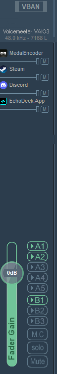
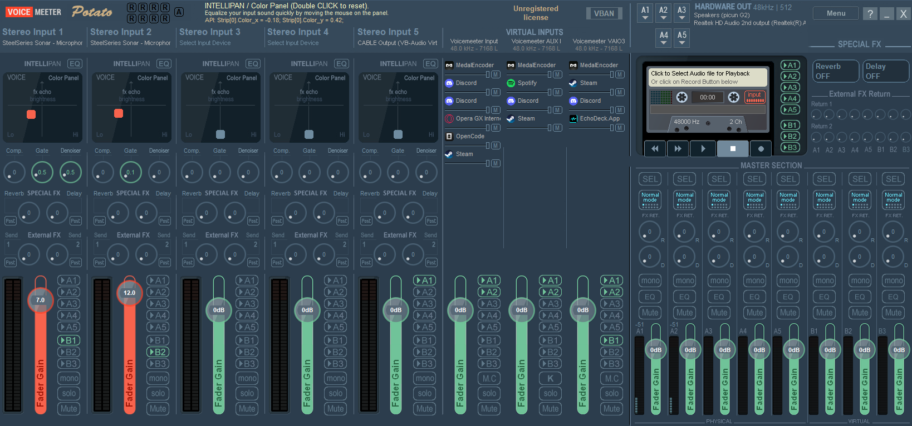

# EchoDeck

**Native Windows Soundboard** — built with WPF and .NET 10.

EchoDeck is a fast, focused soundboard for Windows that works exclusively with [Voicemeeter](https://vb-audio.com/Voicemeeter/). It provides instant audio playback with deep Voicemeeter integration, per-sound hotkeys, category management, and full dark/light theme support.

## Features

- **Instant Playback** — click to play sounds with low-latency WASAPI output
- **Voicemeeter Integration** — automatic detection, connection, reconnection, and preferred output device selection (requires Voicemeeter Potato, Banana, or Standard)
- **Per-Sound Hotkeys** — assign F1–F24 + modifier keys to any sound; global Stop All hotkey
- **Categories** — organize sounds into custom categories with rename, reorder, and bulk reassignment
- **Sound Normalization** — optional RMS-based gain normalization for consistent volume
- **Overlap Control** — prevent or allow simultaneous playback of the same sound
- **Bulk Operations** — multi-select mode for batch volume adjustment and deletion
- **Search & Filter** — real-time search by name, category, or hotkey; filter by favorites or category
- **Watched Folders** — monitor folders for new audio files and auto-import them
- **Multi-Language** — English and Arabic interface; extensible XAML resource dictionary system
- **Dark / Light / System Themes** — full theme support with smooth transitions
- **Import** — import individual audio files or entire folders; drag-and-drop support
- **Library Persistence** — JSON-based library and settings store in the user data folder
- **Minimize to Tray** — optionally minimize or close to system tray

## Requirements

- **Windows 10** or **Windows 11**
- **[Voicemeeter Potato](https://download.vb-audio.com/Download_CABLE/Voicemeeter8Setup_v3122.zip)** (recommended), [Banana](https://download.vb-audio.com/Download_CABLE/VoicemeeterSetup_v2122.zip), or [Standard](https://download.vb-audio.com/Download_CABLE/VoicemeeterSetup_v1122.zip) — **required**, EchoDeck routes audio through Voicemeeter
- **[.NET 10 SDK](https://dotnet.microsoft.com/en-us/download/dotnet/10.0)** (to build from source)
- **[.NET 10 Runtime](https://dotnet.microsoft.com/en-us/download/dotnet/10.0)** (to run pre-built binaries)

> **Note:** EchoDeck does **not** work without Voicemeeter. It uses Voicemeeter's virtual audio devices for all playback.

## Quick Start

```powershell
# Get the code
git clone https://github.com/Faisal11134/EchoDeck.git
cd EchoDeck

# Restore and build
dotnet restore
dotnet build -c Release

# Run
dotnet run --project EchoDeck.App -c Release
```

## Build & Publish

```powershell
# Debug build
dotnet build

# Release build
dotnet build -c Release

# Self-contained publish (x64) — produces a portable folder with all dependencies
dotnet publish -c Release -r win-x64 --self-contained true -o artifacts\publish
```

## Voicemeeter Setup

EchoDeck requires Voicemeeter to be installed and running. Here's how to set it up:

### 1. Install Voicemeeter

| Version | Download |
|---------|----------|
| **Potato** (recommended) | [Download](https://download.vb-audio.com/Download_CABLE/Voicemeeter8Setup_v3122.zip) |
| Banana | [Download](https://download.vb-audio.com/Download_CABLE/VoicemeeterSetup_v2122.zip) |
| Standard | [Download](https://download.vb-audio.com/Download_CABLE/VoicemeeterSetup_v1122.zip) |

Extract the ZIP, run the installer **as administrator**, and reboot your PC.

### 2. Launch Voicemeeter

After reboot, launch Voicemeeter from the Start Menu. Make sure it stays running in the system tray.

### 3. Configure EchoDeck to Use Your Microphone

In Voicemeeter, you need to send your microphone input to EchoDeck:

1. Locate your microphone strip in Voicemeeter (e.g., the **B1** hardware input if you're using VBAN or a physical mic)
2. **Enable the B1 send button** on that strip — this routes your mic to the virtual output that EchoDeck listens on
3. Set your preferred playback output to one of Voicemeeter's hardware outputs (e.g., **VAIO3** — the user's recommended option)

> **Note:** You must route your microphone through Voicemeeter's B1 bus. If your mic strip name is "B1", enable its B1 button.

### 4. Configure Audio in EchoDeck

Open EchoDeck → **Settings** → **Voicemeeter** tab. Select your **Preferred Output** device. EchoDeck will automatically detect and connect to Voicemeeter.

> **Pro tip:** The user who built EchoDeck recommends freeing up one of your Voicemeeter outputs (e.g., VAIO3) exclusively for EchoDeck.

### 5. Set Voicemeeter as Your Default Playback Device

In Windows **Sound Settings**, set **VoiceMeeter Input** (or **Voicemeeter Aux Input** for Potato) as your default playback device so all system audio routes through Voicemeeter.

### Screenshots



*Enable the B1 send button on your microphone strip in Voicemeeter.*



*Select your preferred output in EchoDeck's Voicemeeter tab.*

## Project Structure

```
EchoDeck.App/
├── Converters/               # XAML value converters
├── Infrastructure/           # JSON file store, path utilities
├── Models/                   # Settings, library items, categories, Voicemeeter models
├── Resources/
│   ├── Languages/
│   │   ├── Arabic.xaml       # Arabic resource dictionary
│   │   └── English.xaml      # English resource dictionary
│   └── ThemeStyles.xaml      # Dark/Light theme styles
├── Services/                 # Audio playback, Voicemeeter, hotkeys, library, etc.
├── ViewModels/               # MVVM view models
├── Views/                    # XAML windows and dialogs
├── App.xaml                  # Application entry point
└── EchoDeck.App.csproj
```

## Configuration

Settings are stored in JSON at:

```
%APPDATA%\EchoDeck\settings.json
```

The library database is stored in the same directory as `library.json`.

## License

MIT — see [LICENSE](LICENSE).
